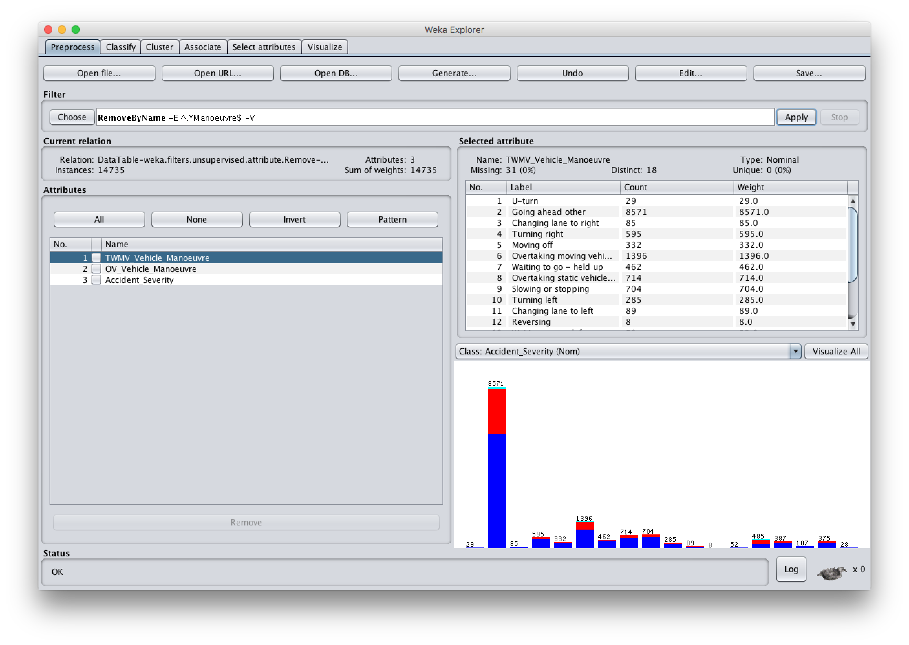
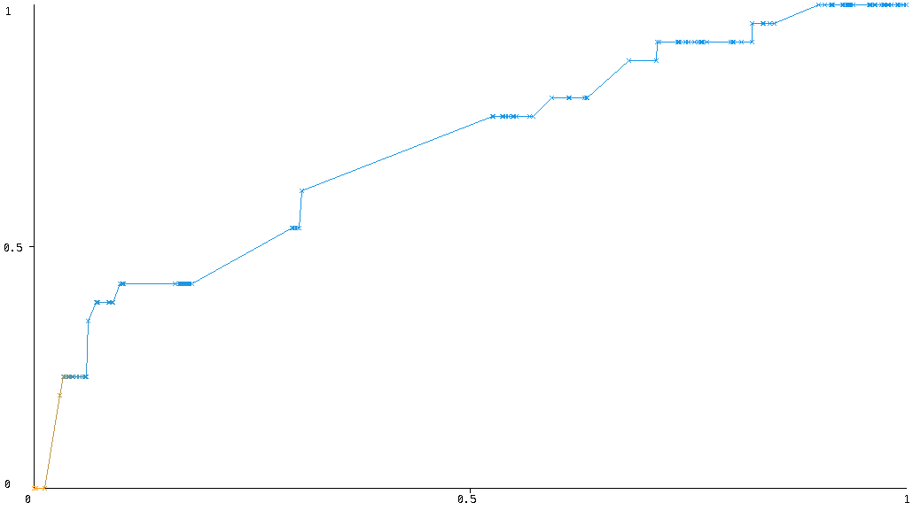

# Data Choice

## Data Set

The open data set used in this report is the Department for Transport's 2016 release of Road Safety Data [@dft], which gives "the circumstances of personal injury road accidents ... the types (including Make and Model) of vehicles involved and the consequential casualties". The data are published annually on the [data.gov.uk](https://data.gov.uk/) website under a licence that permits non-commercial exploitation with attribution [@tna].

The source of the data is the 'STATS19' accident reporting form used by police and so the data is also referred to by this name. The STATS19 data has been recorded (with some changes in attribute semantics) since 1979 [@adls]. The Department for Transport also produces a 'STATS20' document which provides guidance on completing the form defines some of its terminology [@stats20].

The 2016 data set is distributed as three separate ZIP-compressed comma-separated variable (CSV) files, listed in Table \ref{data-files} along with the number of data rows in each (each file also includes a single 'header' row providing metadata [@han, p. 92] in the form of field names).

----------------------------------------------------------------------  ----------
Link                                Decompressed filename               Data rows
----------------------------------  ----------------------------------  ----------
Road Safety Data - Accidents 2016   `dftRoadSafety_Accidents_2016.csv`  136621

Road Safety Data - Vehicles 2016    `Veh.csv`                           252500

Road Safety Data - Casualties 2016  `Cas.csv`                           181384
----------------------------------------------------------------------------------

Table: Overview of 2016 data files\label{data-files}

## Attribute types

Every data row in each data file represents an object with a number of attributes that describe its features or characteristics [@han, p. 40]. The types of each attribute in the data set are summarised in Appendix A.

## Coding of nominal data

Many attributes in the data set are of nominal data type (that is, representing names of things) but contain integer values. For example, an object in the *Accidents* file may have a value of *20* for the attribute `Police_Force`, but this number is not intended to be used quantitively, instead it represents a nominal value [@han, p. 41]. In this case, *20* represents the West Midlands police force.

An accompanying Excel spreadsheet `Road-Accident-Safety-Data-Guide.xls` (linked under *Additional resources*) provides lookup tables of all possible values for such 'coded' nominal types. This means such attributes have an _enumerated value domain_ [@oecd]. The spreadsheet also explains that the special value `-1` represents "NULL or out of range values".

## Data relationships

The Excel spreadsheet that accompanies the data set also explains the relations between the individual files:

> The ACC_Index field give a unique index for each accident and links to Vehicle and Casualty data. Casualties are linked to vehicles by "VEHREF".

Each of the three files therefore constitutes a relation with its own primary key [@codd], with `ACC_Index` (given as `Accident_Index` in the CSV header rows) as a unique accident identifier and `Casualty_Reference` and `Vehicle_Reference` identifying each casualty and the vehicle with which they are associated, respectively. The primary keys for each relation are shown in the simplified Entity Relationship (ER) diagram in Figure \ref{entity-relationship}.

{ width=80% }

The `Number_of_Vehicles` and `Number_of_Casualties` fields in the *Accidents* file indicate the number of related rows in the other two files. For example, if `Number_of_Vehicles` is `2`, there will be two rows in the *Vehicles* file with the same `Accident_Reference`, having a `Vehicle_Reference` of 1 and 2 respectively. The same applies to casualties.

## Applicability of data mining techniques

### Clustering

Cluster analysis involves "grouping objects that are similar to each other and dissimilar to the objects belonging to other clusters" [@bramer, p. 311]. This technique, a form of unsupervised machine learning, might allow us to discover classes of accidents that have similar characteristics and make them the focus of further analysis. In practice this could eventually lead to recommendations about additional safety measures (for example, changes to road design or rider training) that might reduce the prevalance of such accident classes.

Two challenges of this data set for clustering analysis are its large number of attributes and the fact that it mainly consists of nominal attributes, since many clustering algorithms focus on numeric data and work best with a small number of attributes [@han, p. 446-7].


### Literature review

Hill [-@hill] evaluated the usefulness of several cluster analysis methods in identifying relatively homogenous groups of accidents from the STATS19 data from 1997 and 2002 for further investigation with a goal "to generate ideas for how the number of these accidents might be reduced". SPSS TwoStep, CHAID and cross-tabulation were evaluated, with the last two being the most promising. For Hill two-step cluster analysis on these data requires too much subjective intervention by the analyst and produces less 'transparent' results than the latter two methods.

Although the TwoStep algorithm [@twostep] is efficient on large datasets and supports a mixture of continuous and categorical variables, SPSS was not available for this report to compare with Hill's findings.


Castro and Kim [-@castro] approached identifying the factors that contribute the most to accident severity in STATS19 datasets as a classification problem, where the classifier models created were used to predict the class (severity) of the accident. WEKA was used to create a Bayesian (belief) network, a C4.5-based decision tree and a multi-layer perceptron (neural network) and the accuracy of each in classifying unseen instances was tested using crossfold validation. The results showed that the Bayesian network was the most accurate and that light conditions and road type were the most significant factors. However, extensive filtering and other preprocessing was preformed on the data.

Ehsaei and Evdorides [-@ehsaei] used data mining techniques to analyse the temporal variation in contribution of road infrastructure features to accident severity over a five-year period, in response to changes in national road policies. The reserchers again used WEKA and a Bayesian network, but limited their study only to accidents in the Greater Manchester area and to road infrastructure features. Training and testing was performed using a 66%/34% split. However, rather than attempting to demonstrate the accuracy of their model, in their results they extracted the the probabilities of different road features (such as 'Junction Detail') occuring in conjunction with different severities from the classifier. This served as a way of identifying the most high-risk locations on the road network.


# Data Analysis

As the data set contains over 70 attributes this section will focus only on selected attributes as illustrations of the process of data analysis.

## `Number_of_Vehicles`

The attribute `Number_of_Vehicles` (in the *Accidents* file) represents how many vehicles were involved in each accident. It is a numeric ratio-scaled attribute (that is, has an inherent zero-point) however as a typical 'count' attribute its values are only integers. In the 2016 data set it has no missing values.

Using the *Statistics* node in KNIME we can calculate some basic statistical descriptions for this attribute. The minimum and maximum values are 1 and 16 respectively. The **mean** number of vehicles in an accident is 1.8482, however as the data are positively skewed for this attribute (skew = 1.5756) a better measure of the centrally tendency is the **median** [@han, p. 46]. Here we can say that the median accident involved 2 vehicles. The **mode** is also 2. The histogram in Figure \ref{number-of-vehicles} shows the distribution of values for this attribute. Values of 6 and above are grouped together as they account for only a very small proportion of the data.

{ width=80% }

## `Vehicle_Type`

The `Vehicle_Type` attribute in the *Vehicles* file indicates the type of each vehicle involved in an acident. It is a nominal (categorical) attribute. Although represented as an integer, it does not make sense to perform mathematical operations on it so we cannot calculate the mean vehicle type [@han, p. 78], however the mode (most commonly occuring) type is 9 (Car). The integer values correspond to values in the *Vehicle Type* sheet of Excel spreadsheet that accompanies the data.

\begin{sidewaysfigure}
\centering
\includegraphics{vehicle-type-correlation.pdf}
\caption{Workflow for vehicle type correlation matrix\label{vehicle-type-correlation}}
\end{sidewaysfigure}

The KNIME workflow *Vehicle type correlation matrix* produces a correlation matrix for vehicle types in accidents involving two vehicles. In the resulting table, both the rows and columns represent a given vehicle type and the intersecting cell gives the number of accidents involving that combination of vehicles. This can be further visualised as a 'heat map' such as Figure \ref{vehicle-type-heatmap} in order to reveal possible patterns. Cells are highlighted in different shades of red depending on their value; the highlighting midpoint was set to the 85th percentile after some experimentation to produce the clearest differentiation between cells. Note that cells along the top diagonal need to have their values halved to avoid showing a double count; this is because of the way the Joiner and Pivoting nodes work.

\begin{sidewaysfigure}
\centering
\includegraphics{vehicle-type-heatmap.pdf}
\caption{Heat map for \texttt{Vehicle\_Type} in two-vehicle
accidents\label{vehicle-type-heatmap}}
\end{sidewaysfigure}

## `Date`

The `Date` attribute in the *Accidents* file is a string representation (with the format `MM/dd/YYYY`) of the calendar date between 1 January and 31 December 2016 that each accident occurred. It considered interval-scaled because it is measured on a scale of equal-size units (here days) but no true zero-point [@han, p. 80].

Every date occcurs at least once in the data set. Using the *Statistics* node in KNIME we can determine that the date that occurs the most (i.e. with the most accidents) was 25 November, with 566 accidents. This is therefore the mode date. However least-occurring date (i.e. with the least accidents) was 25 December, with only 138, which is likely due to fewer people travelling on Christmas Day. For comparison, since 2016 was a leap year with 366 days and the *Accidents* file contains data about 136621 accidents, we can say that the mean number of accidents per day was 373.28.

Although analysis of accident numbers over the year might reveal seasonal trends, to be sound any conclusions would need to be supported by comparison with data from other years. Since reviewing multiple years' data is out of scope for this report, an alternate approach is to look for trends within the year under study. For example, we may wish to know if significantly different numbers of accidents occur at weekends. Figure \ref{day-of-week-boxplot} uses a box plot to visualise the distribution of of accidents per day of the week. Each bar represents a different day. Data points that are more than 1.5 times the inter-quartile range (IQR) are plotted separately, all of which are classified by KNIME as 'mild' outliers.


From this we can see that the number of accidents increases slightly as the week progresses, and that weekends have significantly fewer accidents. It is also notable that the 'whiskers' (representing the maximum and minimum values) for Friday are much longer for other days. Table \ref{day-of-week-table} confirms that Friday has a much larger standard deviation than other days of the week, meaning that it has the greatest dispersion of values.

-------------------------------------
Day of week  Min  Max  Mean    StdDev
-----------  ---  ---  ------  ------
Monday       187  467  370.69  57.34

Tuesday      261  521  386.62  46.42

Wednesday    286  519  401.37  47.73

Thursday     295  537  402.87  47.43

Friday       249  566  426.02  63.82

Saturday     201  417  336.19  42.73

Sunday       138  383  288.92  42.34
-------------------------------------

Table: Distribution of accidents by day of week\label{day-of-week-table}

Note that this analysis does not allow us to conclude that weekends are somehow inherently safer - there may simply be less traffic. In order to know for sure we would need to cross-reference data about how many vehicles are on the road on each day, which is beyond the scope of this study.

## `Time`

The `Time` attribute in the *Accidents* file represents the time of day that an accident occurred. Like `Date`, it is an interval-scaled attribute with values ranging from `00:00` (midnight) to `23:59`. By extracting the hour and minute components from each time we can produce histograms that reveal patterns in the data.

Figure \ref{accidents-by-hour} shows the number of accidents that occur during each hour of the day, from 0 to 23, across the whole data set. This shows that the fewest accidents occur between 04:00-04:59, while there are noticeable peaks between 08:00-08:59 and 17:00-17:59. These peaks could be predicted as they correspond to the usual 'rush hours' at the start and end of the working day. Nearly 25% of accidents occurred between 8am and 9am or between 4pm and 6pm.

Similarly, Figure \ref{accidents-by-min} shows the number of accidents that occur during each minute of the day, from 0 to 59, across the whole data set. It is apparent that the most frequent times are on the hour and half-past the hour, with smaller peaks every five minutes. Although this could mean that acccidents happens more frequently at these points, a more likely explanation is that the police offers reporting the accident often round their approximation of the accident time to the nearest 5- or 30-minute boundary. This 'snapping' effect implies that attempting to analyse the `Date` and `Time` attributes with a resolution of less than 5 minutes is unlikely to be successful. A comparable level of accuracy in police reporting road accident times was inferred for road accident data collected about Helsinki's Ring Road [@innamaa, p. 18].

{ width=80% }

{ width=80% }

## Data Preprocessing

We can use the knowledge that the majority (around 60%) of accidents involve two vehicles to focus this study and eliminate some of the complexity that arises from one-to-many data relationships. By considering only accidents involving two vehicles, we can 'denormalise' the *Accident* and *Vehicle* files to allow for further processing.

## Reducing dimensions

As the dataset contains a very large number of dimensions, the amount of storage space and processing time required to cross-tabulate every possible combination of attributes and then examine could be prohibitive (an example of the so-called 'curse of dimensionality' [@han, p. 158]). In order to simplify exploration of the data in WEKA the following attributes were removed from the data before exporting to ARFF format:

- `1st_Road_Number` and `2nd_Road_Number`
- `TWMV_Was_Vehicle_Left_Hand_Drive?` (the value of this is always `No` since it does not make sense for TWMVs)
- `Vehicle_IMD_Decile` (this attribute is not described in the lookup tables, and inspecting it in KNIME shows that its values are always identical to `Driver_IMD_Decile`)

## Importing into WEKA

In order to import the dataset into WEKA for exploration it must to be converted to WEKA's ARFF format [@arff] which includes type information. The *ARFF Writer* node in KNIME supports creating files in this format, however it does not seem to support WEKA's `DATE` type but outputs these attributes as STRING instead. In order to work around this the file must be post-processed after generation, such as by using `sed(1)`:

    sed -ipe "s/^@ATTRIBUTE DateTime.*/@ATTRIBUTE DateTime DATE yyyy-MM-dd'T'HH:mm/" \
        Accidents-2Veh-TWMV.arff

## Missing values

There are two different types of missing values in the datset. For example, the *Accidents* file contains 7 objects with missing longitude/latitude and 37 with a missing speed limit, represented as empty strings and the literal `NULL` in the input CSV, respectively (this can be determined through the *Statistics* node in KNIME). However, the lookup tables show that many of the nominal attributes (e.g. `Road_Type`) support an explicit code for missing or unknown values, usually `-1` defined as *Data missing or out of range*. Some attributes also specify an additional code defined as 'Unknown' or 'Not known'.

For consistency and to enable WEKA to identify and handle missing values, all such nominal value codes were folded to 'true' missing values during pre-processing in KNIME by limiting the number of rows read by the *Excel Reader* node prior to being looked up by *Cell Replacer*. Note that this process did not include values such as `Unclassified` for `Road_Type`, since despite the name this is a valid type of road rather than missing data.

NB two accidents have a missing value for `Time`.

## Choice of tools

KNIME 3.5.1 was chosen ... (talk about metanodes, documentation etc.)

Python 2.7.13 with the `pandas`, `protobuf` and `jedi` extensions (installed as per the [KNIME documentation](https://www.knime.com/blog/how-to-setup-the-python-extension) and the `kmodes` extension (installed following the steps on the the [k-modes GitHub repo](https://github.com/nicodv/kmodes))

Other extensions used:
- matplotlib
- scikit-learn

In addition, the histogram and heat map figures in the report were prepared using Google Sheets for improved visual clarity.

# Classification

Classification is a data mining functionality that divides up objects (instances) into a number of categories or classes. These classes are typically mutually exclusive and exhaustive [@bramer, p. 21].

In order to perform classification on the dataset it is necessary to select a suitable attribute to represent the 'class' of each accident. The `Accident_Severity` attribute was selected as it represents a significant feature of the accident that we would like to be able to predict based on other features. In real world terms, this means that an accurate classifier model could predict which types of accidents are likely to be the most serious based on their other characteristics.

## Choice of classifier and features

Hill used cross-tabulation to identify clusters of vehicle maneouvres that are heavily represented in the accident data, including a group where another vehicle turns right while the TWMV performs any manoeuvre [-@hill, p. p10]. It is of interest to know which combination(s) of maneouvres are likely to result in a severe or fatal accident. Put another way, we would like to be able to predict the probability of an accident belonging to a given severity class, based on the maneouvres involved. We will assume that the type of each manoeuvre is independent of the other.

The naïve Bayes algorithm uses probability theory to find the most likely classification [@bramer, p. 22]. It is called naïve because the algorithm operates on the assumption that the effect of each attribute value on the classification is equally important and independent of the other attributes, but is known to often give surprisingly good results in practice [@bramer, p. 26]. By exploring this relatively straightforward probablistic model, we follow Witten et al.'s advice to try the simplest things first [-@witten, ch. 4].

Another reason for choosing this algorithm is that the dataset contains a large number of missing values, and naïve Bayes naturally handles missing values by not including such attributes in its calculations [@witten, ch. 4]. By contrast, algorithms such as decision trees require special handling for missing values (such as treating them as values in their own right, or splitting instances - [@witten, ch. 3]).

## Parameters

The naïve Bayes approach assumes that all attributes are nominal [@bramer, p. 29] therefore other attribute types must be converted to that type, or discarded.

For a first attempt we take the approach of discarding all attributes except for the ones relating to vehicle maneouvres and the accident severity, i.e. `TWMV_Vehicle_Manoeuvre`, `OV_Vehicle_Maneouvre` and `Accident_Severity`. The `RemoveByName` WEKA filter can be used to remove all other attributes as follows:

```
weka.filters.unsupervised.attribute.RemoveByName -E ^.*Manoeuvre$ -V
```

The WEKA Explorer interface with this filter applied is shown in Figure \ref{weka-removebyname}.



The NaiveBayes classifier is then run using the parameters shown in Table \ref{weka-bayesparams}:

-----------------------------------------
Parameter                    Value
-----------------------      ------------
batchSize                    100

debug                        False

displayModelInOldFormat      False

doNotCheckCapabilities       False

numDecimalPlaces             2

useKernelEstimator           False

useSupervisedDiscretization  False
-----------------------------------------

Table: Initial parameters for NaiveBayes classifier in WEKA\label{weka-bayesparams}

The motivation for these parameters are as follows:

- The default value for batch size is acceptable, and debug output is not required
- Precision of greater than two decimal places when outputting the model is not needed 
- Numeric attributes have already been removed used so the `useKernelEstimator` and `useSupervisedDiscretization` parameters are not relevant

## Training and testing

The data were partitioned into a training and test set using the holdout method with a 90%/10% split via the 'Percentage split' option in WEKA, which divides up the data after shuffling it randomly. This means the model is trained with the training set and tested with the remainder to estimate its accuracy. It is important that the model is not also tested using the data that were used to construct it in order to avoid obtaining an over-optimistic estimate of its accuracy [@witten, ch. 5]. As the dataset is very large, cross-validation was considered but deemed unnecessary.

## Results

The overall recognition rate of the Bayesian classifier on the test data after training was 73.7%, meaning it predicted that proportion of classes in the test data correctly; this is also known as its accuracy [@han, p. 366]. The confusion matrix in Table \ref{naivebayes-confusion} shows counts for actual (rows) and predicted (columns) classes.

---------------------------------------------------------------------------------------
         Slight  Serious  Fatal  Total  True positive rate (%)  False positive rate (%)
-------  ------  -------  -----  -----  ----------------------  -----------------------
Slight     1065       15      0   1080                    98.6                     93.4

Serious     346       21      0    367                     5.7                      1.8

Fatal        21        5      0     26                     0.0                      0.0

Total      1432       41      0   1473
---------------------------------------------------------------------------------------

Table: Confusion matrix for NaiveBayes classifier\label{naivebayes-confusion}

It is interesting to note that few serious accidents were correctly identified, no fatal accidents were correctly identified. All figures are given to one decimal place.

### Accuracy baseline

In order to have a baseline accuracy against which to compare the model, we can use a method such as ZeroR [@zeror]. This allows us to demonstrate whether the classifier is a significant improvement on simply guessing the class based on the most prevalent one (i.e. the mode).

When ZeroR was used as a classifier in WEKA, with the entire dataset used for testing (since holding out some of the data is unnecessary), the overall accuracy was also 72.4%. Detailed results are shown in the confusion matrix in Table \ref{zeror-confusion}.

---------------------------------------------------------------------------------------
         Slight  Serious  Fatal  Total  True positive rate (%)  False positive rate (%)
-------  ------  -------  -----  -----  ----------------------  -----------------------
Slight    10673        0      0  10673                   100.0                    100.0

Serious    3862        0      0   3862                     0.0                      0.0

Fatal       200        0      0    200                     0.0                      0.0

Total     14735        0      0  14735
--------------------------------------------------------------------------------------------

Table: Confusion matrix for ZeroR classifier\label{zeror-confusion}

Since 'Slight' is the most common class, 100% of these instances are correctly classified by ZeroR, however no 'Serious' or 'Fatal' accidents are correctly classified.

### Class imbalance

The 'class imbalance problem' describes a situation where the class (or classes) of interest are rare [@han, p. 367]. This applies to the current dataset, since we are interested to know which circumstances produce the worst accidents, and fatal accidents represent just over 1% of the dataset. Moreover, the cost of more severe accidents (both financial and social) is likely to be greater than for slight accidents.

To assess this it is helpful to consider the true positive rate (sensitivity) and false positive rate for each class as well as the model's overall accuracy. The true positive (TP) rate is the proportion of instances of each class where the class label was predicted correctly, while the FP rate is the proportion of instances that were mislabelled with the class. These figures are both included in Tables \ref{zerror-confusion} and \ref{naivebayes-confusion}.

### Receiver operating characteristic curves

Receiver operating characteristic (ROC) curves can be used to visualise the trade-off between the true positive rate and false positive rates for a given class [@han, p. 374]. Since naïve Bayesian classifiers return a class probability for each prediction they can be used to plot ROC curves as an aid to tuning the learning approach. Figure \ref{naivebayes-roc} shows such a curve for the model produced above with respect to the 'fatal' accident severity. This is produced in WEKA by right-clicking on the result and selecting 'Visualize threshold curve > Fatal'.



The closer to the diagonal the curve is, the less accurate the model is with respect to predicting the class. We can also use the area under the curve as a measure of its accuracy, which here is 0.70.

## Tuning strategy

As mentioned above, severe and fatal accidents are likely to have a greater social and economic impact and be in greater need of further investigation. They also represent a relatively small proportion of the dataset. We would like to be able to improve the accuracy of the naïve Bayes classifier with respect to correctly identifying these classes of accident.

### Cost-sensitive learning

This technique uses a cost matrix to assign different costs to the different types of classifier error 


## Final results

# Clustering

Clustering is a form of unsupervised data mining in which objects that are similar are grouped together [@bramer, p. 312].

# Critical review

## Difficulties and mistakes

### Choice of dataset

The selection of the dataset used in the study clearly created a number of additional challenges. Some of these related to the extensive amount of pre-processing required on the data, for example to denormalise the *Accidents* and *Vehicles* tables. Furthermore, the class distribution is heavily skewed towards 'slight' accidents, which required further effort in the classification task to ensure that more serious accidents could be predicted.

## Future work

### Missing values

Missing values could occur because of a number of reasons, such as error on behalf of the police officer or during data entry. However, as Witten et. al [-@witten] point out, some missing values can be due to a conscious decision rather than error. One area for further investigation could be to identify those missing values which may mean 'not applicable'. For example, 28% of instances have a missing value for `2nd_Road_Class` - this could be because there was no second road. Reviewing official guidance on completing the form [@stats20] might inform further data preprocessing to handle these values correctly.

### Using Bayes' Theorem to classify fatal maneouvres

Following the work done in the Classification task, a new Bayesian classifier could be built that can predict the severity of an accident based on the maneouvres involved, with a variable threshold. This was not  attempted in this study, but some of the calculations required are described below:

Let _A_ be an accident involving two manoeuvres (the 'evidence', in Bayesian terms). _H_ is the hypothesis that _A_ is fatal, that is it belongs to the 'fatal' class. We want to determine _P_(_H_|_A_), the probability of this hypothesis conditioned on the observed maneouvres (the posterior probability). 

_P_(_H_) is the prior probability of _H_, here meaning the probability that any accident will be fatal regardless of maneouvres. This can be estimated by counting the number of fatal accidents in the dataset and dividing it by the total number of accidents: 200/14735 = 0.014.

_P_(_A_|_H_) is the posterior probability of _A_ conditioned on _H_, i.e. the probability that an accident involves two specific maneouvres, given we know the accident is fatal. By assuming there is no dependency between the maneouvres _m~1~_ and _m~2~_, we can calculate this as _P_(_m~1~_|_H_) × _P_(_m~2~_|_H_) by counting the number instances in the training set where each maneouvre occurs for a fatal accident. For example, there are 27 accidents where the TWMV was overtaking a moving vehicle out of 200 fatal accidents, so _P_(_m~1~_|_H_) here is 27/200 = 0.135.

_P_(_A_) is the prior probability of _A_, meaning the probability that any accident in the dataset involves the two given maneouvres, i.e. _P_(_m~1~_) × _P_(_m~2~_).

We could then use Bayes' theorem to estimate the probability that any new accident with those manoeuvres is fatal:

$$ P(H \mid A) = \frac{P(A \mid H) \, P(H)}{P(A)} $$

The final step would be to determine a probability threshold for identifying an accident as fatal. For example, we could say that if the probability is > 0.75 then the accident is fatal, and test by holding out some of the data. The results from this investigation could be used to validate Hill's findings described earlier.

### Longitudinal study

Since the same STATS19 format has been used since [TBC] there is considerable scope for looking at how patterns in the data have evolved over time. [@castro] looked at datasets from both 2010 and 2012, while [@ehsaei] considered trends over the period [TBC]. An area for further investigation could be to take the models trained here against the 2016 dataset and test them against releases from previous years to evaluate any changes in accuracy.

#### Clustering nominal data

Partioning methods of cluster analysis find mutually exclusive clusters that are spherical in shape, using a distance function to measure the similarity of objects within a cluster and therefore minimise the amount of within-cluster variation [@han, p. 489]. Of these methods, the popular _k_-means algorithm uses the arithmetic mean to find the centroid of each cluster and therefore needs numerical attributes. The _k_-modes method put forward by Huang [-@huang] is an extension to _k_-means which supports nominal (categorical) attributes, utilising the mode instead of the mean. Because of the large amount of nominal attributes in the dataset, _k_-modes could be used as a more effective clustering approach.

Since KNIME and Weka do not have built-in support for _k_-modes, a KNIME *Python Script* node could be used to provide the algorithm using an external Python interpreter, using a popular open-source implementation [@devos]. The workflow shown in Figure \ref{knime-kmodes} and basic Python code is given below:

```python
import numpy as np
import pandas as pd
from kmodes.kmodes import KModes

kmodes_huang = KModes(n_clusters=4, init='Huang', verbose=1)
clusters = kmodes_huang.fit_predict(input_table)

output_table = pd.DataFrame(data=clusters, dtype=np.int64)
```


The result of this workflow is an additional numeric attribute dataset that identifies the cluter with which each object has been associated. Further areas of study could involve how to visualise and characterise such clusters, for example using silhouettes [@rousseeuw] to evaluate cluster quality and suggest the optimal number of clusters .

# Appendix: Summary of KNIME workflows

Table \ref{knime-workflows} summarises the KNIME workflows included with this report.

--------------------------------------------------------------------------------------------
Workflow                                 Purpose
---------------------------------------  ---------------------------------------------------
Accident date distribution               Creates a box plot for accidents by day of the week
                                         and statistics table

Vehicle Type correlation matrix          Generates a correlation matrix of vehicle types
(Figure \ref{vehicle-type-correlation})  in two-accident collisions suitable for rendering
                                         as a heat map

Accident date distribution               Generates a box plot showing distribution of
                                         accident dates and statistical summary
--------------------------------------------------------------------------------------------

Table: Summary of KNIME workflows\label{knime-workflows}

# References
