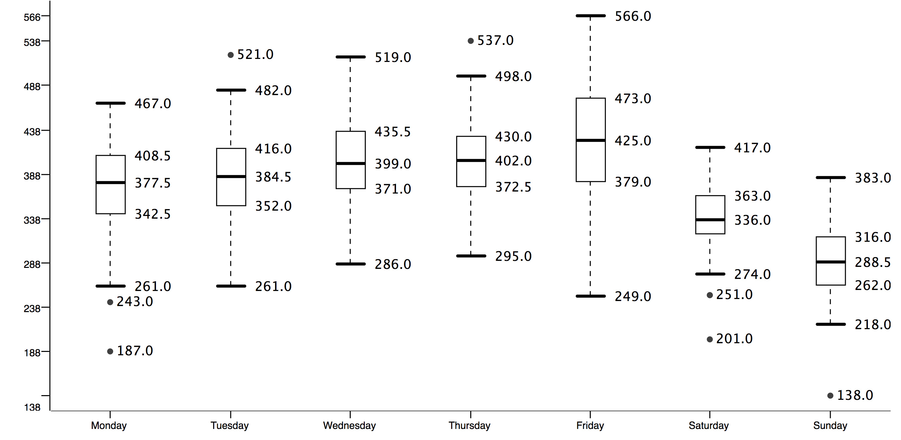

# Data Choice

## Data Set

The open data set used in this report is the Department for Transport's 2016 release of Road Safety Data [@dft], which gives "the circumstances of personal injury road accidents ... the types (including Make and Model) of vehicles involved and the consequential casualties". The data are published annually on the [data.gov.uk](https://data.gov.uk/) website under a licence that permits non-commercial exploitation with attribution [@tna].

The source of the data is the 'STATS19' accident reporting form used by police and so the data is also referred to by this name. The STATS19 data has been recorded (with some changes in attribute semantics) since 1979 [@adls]. The Department for Transport also produces a 'STATS20' document which provides guidance on completing the form defines some of its terminology [@stats20].

The 2016 data set is distributed as three separate ZIP-compressed comma-separated variable (CSV) files, listed in Table \ref{data-files} along with the number of data rows in each (each file also includes a single 'header' row providing metadata [@han, p. 92] in the form of field names).

----------------------------------------------------------------------  ----------
Link                                Decompressed filename               Data rows
----------------------------------  ----------------------------------  ----------
Road Safety Data - Accidents 2016   `dftRoadSafety_Accidents_2016.csv`  136621

Road Safety Data - Vehicles 2016    `Veh.csv`                           252500

Road Safety Data - Casualties 2016  `Cas.csv`                           181384
----------------------------------------------------------------------------------

Table: Overview of 2016 data files\label{data-files}

## Attribute types

Every data row in each data file represents an object with a number of attributes that describe its features or characteristics [@han, p. 40]. The types of each attribute in the data set are summarised in Appendix A.

## Coding of nominal data

Many attributes in the data set are of nominal data type (that is, representing names of things) but contain integer values. For example, an object in the *Accidents* file may have a value of *20* for the attribute `Police_Force`, but this number is not intended to be used quantitively, instead it represents a nominal value [@han, p. 41]. In this case, *20* represents the West Midlands police force.

An accompanying Excel spreadsheet `Road-Accident-Safety-Data-Guide.xls` (linked under *Additional resources*) provides lookup tables of all possible values for such 'coded' nominal types. This means such attributes have an _enumerated value domain_ [@oecd]. The spreadsheet also explains that the special value `-1` represents "NULL or out of range values".

## Data relationships

The Excel spreadsheet that accompanies the data set also explains the relations between the individual files:

> The ACC_Index field give a unique index for each accident and links to Vehicle and Casualty data. Casualties are linked to vehicles by "VEHREF".

Each of the three files therefore constitutes a relation with its own primary key [@codd], with `ACC_Index` (given as `Accident_Index` in the CSV header rows) as a unique accident identifier and `Casualty_Reference` and `Vehicle_Reference` identifying each casualty and the vehicle with which they are associated, respectively. The primary keys for each relation are shown in the simplified Entity Relationship (ER) diagram in Figure \ref{entity-relationship}.

{ width=80% }

The `Number_of_Vehicles` and `Number_of_Casualties` fields in the *Accidents* file indicate the number of related rows in the other two files. For example, if `Number_of_Vehicles` is `2`, there will be two rows in the *Vehicles* file with the same `Accident_Reference`, having a `Vehicle_Reference` of 1 and 2 respectively. The same applies to casualties.

## Applicability of data mining techniques

### Literature review

Hill [-@hill] evaluated the usefulness of several cluster analysis methods in identifying relatively homogenous groups of accidents from the STATS19 data for further investigation. Two-step, CHAID and cross-tabulation were considered, with the last two yielding the most promising results. The author found two-step cluster analysis as requiring too much subjective intervention by the analyst and producing less 'transparent' results than the other two methods.

# Data Analysis

As the data set contains over 70 attributes this section will focus only on selected attributes as illustrations of the process of data analysis.

## `Number_of_Vehicles`

The attribute `Number_of_Vehicles` (in the *Accidents* file) represents how many vehicles were involved in each accident. It is a numeric ratio-scaled attribute (that is, has an inherent zero-point) however as a typical 'count' attribute its values are only integers. In the 2016 data set it has no missing values.

Using the *Statistics* node in KNIME we can calculate some basic statistical descriptions for this attribute. The minimum and maximum values are 1 and 16 respectively. The **mean** number of vehicles in an accident is 1.8482, however as the data are positively skewed for this attribute (skew = 1.5756) a better measure of the centrally tendency is the **median** [@han, p. 46]. Here we can say that the median accident involved 2 vehicles. The **mode** is also 2. The histogram in Figure \ref{number-of-vehicles} shows the distribution of values for this attribute. Values of 6 and above are grouped together as they account for only a very small proportion of the data.

{ width=80% }

## `Vehicle_Type`

The `Vehicle_Type` attribute in the *Vehicles* file indicates the type of each vehicle involved in an acident. It is a nominal (categorical) attribute. Although represented as an integer, it does not make sense to perform mathematical operations on it so we cannot calculate the mean vehicle type [@han, p. 78], however the mode (most commonly occuring) type is 9 (Car). The integer values correspond to values in the *Vehicle Type* sheet of Excel spreadsheet that accompanies the data.

\begin{sidewaysfigure}
\centering
\includegraphics{vehicle-type-correlation.pdf}
\caption{Workflow for vehicle type correlation matrix\label{vehicle-type-correlation}}
\end{sidewaysfigure}

The KNIME workflow *Vehicle type correlation matrix* produces a correlation matrix for vehicle types in accidents involving two vehicles. In the resulting table, both the rows and columns represent a given vehicle type and the intersecting cell gives the number of accidents involving that combination of vehicles. This can be further visualised as a 'heat map' such as Figure \ref{vehicle-type-heatmap} in order to reveal possible patterns. Cells are highlighted in different shades of red depending on their value; the highlighting midpoint was set to the 85th percentile after some experimentation to produce the clearest differentiation between cells.

\begin{sidewaysfigure}
\centering
\includegraphics{vehicle-type-heatmap.pdf}
\caption{Heat map for \texttt{Vehicle\_Type} in two-vehicle
accidents\label{vehicle-type-heatmap}}
\end{sidewaysfigure}

## `Date`

The `Date` attribute in the *Accidents* file is a string representation (with the format `MM/dd/YYYY`) of the calendar date between 1 January and 31 December 2016 that each accident occurred. It considered interval-scaled because it is measured on a scale of equal-size units (here days) but no true zero-point [@han, p. 80].

Every date occcurs at least once in the data set. Using the *Statistics* node in KNIME we can determine that the date that occurs the most (i.e. with the most accidents) was 25 November, with 566 accidents. This is therefore the mode date. However least-occurring date (i.e. with the least accidents) was 25 December, with only 138, which is likely due to fewer people travelling on Christmas Day. For comparison, since 2016 was a leap year with 366 days and the *Accidents* file contains data about 136621 accidents, we can say that the mean number of accidents per day was 373.28.

Although analysis of accident numbers over the year might reveal seasonal trends, to be sound any conclusions would need to be supported by comparison with data from other years. Since reviewing multiple years' data is out of scope for this report, an alternate approach is to look for trends within the year under study. For example, we may wish to know if significantly different numbers of accidents occur at weekends. Figure \ref{day-of-week-boxplot} uses a box plot to visualise the distribution of of accidents per day of the week. Each bar represents a different day. Data points that are more than 1.5 times the inter-quartile range (IQR) are plotted separately, all of which are classified by KNIME as 'mild' outliers.

From this we can see that the number of accidents increases slightly as the week progresses, and that weekends have significantly fewer accidents. It is also notable that the 'whiskers' (representing the maximum and minimum values) for Friday are much longer for other days. Table \ref{day-of-week-table} confirms that Friday has a much larger standard deviation than other days of the week, meaning that it has the greatest dispersion of values.

-------------------------------------
Day of week  Min  Max  Mean    StdDev
-----------  ---  ---  ------  ------
Monday       187  467  370.69  57.34

Tuesday      261  521  386.62  46.42

Wednesday    286  519  401.37  47.73

Thursday     295  537  402.87  47.43

Friday       249  566  426.02  63.82

Saturday     201  417  336.19  42.73

Sunday       138  383  288.92  42.34
-------------------------------------

Table: Distribution of accidents by day of week\label{day-of-week-table}

Note that this analysis does not allow us to conclude that weekends are somehow inherently safer - there may simply be less traffic. In order to know for sure we would need to cross-reference data about how many vehicles are on the road on each day, which is beyond the scope of this study.

## `Time`

The `Time` attribute in the *Accidents* file represents the time of day that an accident occurred. Like `Date`, it is an interval-scaled attribute with values ranging from `00:00` (midnight) to `23:59`. By extracting the hour and minute components from each time we can produce histograms that reveal patterns in the data.

Figure \ref{accidents-by-hour} shows the number of accidents that occur during each hour of the day, from 0 to 23, across the whole data set. This shows that the fewest accidents occur between 04:00-04:59, while there are noticeable peaks between 08:00-08:59 and 17:00-17:59. These peaks could be predicted as they correspond to the usual 'rush hours' at the start and end of the working day. Nearly 25% of accidents occurred between 8am and 9am or between 4pm and 6pm.

Similarly, Figure \ref{accidents-by-min} shows the number of accidents that occur during each minute of the day, from 0 to 59, across the whole data set. It is apparent that the most frequent times are on the hour and half-past the hour, with smaller peaks every five minutes. Although this could mean that acccidents happens more frequently at these points, a more likely explanation is that the police offers reporting the accident often round their approximation of the accident time to the nearest 5- or 30-minute boundary. This 'snapping' effect implies that attempting to analyse the `Date` and `Time` attributes with a resolution of less than 5 minutes is unlikely to be successful. A comparable level of accuracy in police reporting road accident times was inferred for road accident data collected about Helsinki's Ring Road [@innamaa, p. 18].

{ width=80% }

{ width=80% }

## Missing values

## Data Preprocessing

We can use the knowledge that the majority (around 60%) of accidents involve two vehicles to focus this study and eliminate some of the complexity that arises from one-to-many data relationships. By considering only accidents involving two vehicles, we can 'denormalise' the *Accident* and *Vehicle* files to allow for further processing.

# Appendix: Summary of software and KNIME workflows

The software used in producing the figures and tables in this report is:

- KNIME 3.5.1
- Google Sheets (histograms, heat maps)

Table \ref{knime-workflows} summarises the KNIME workflows included with this report.

--------------------------------------------------------------------------------------------
Workflow                                 Purpose
---------------------------------------  ---------------------------------------------------
Accident date distribution               Creates a box plot for accidents by day of the week
                                         and statistics table

Vehicle Type correlation matrix          Generates a correlation matrix of vehicle types
(Figure \ref{vehicle-type-correlation})  in two-accident collisions suitable for rendering
                                         as a heat map

Accident date distribution               Generates a box plot showing distribution of
                                         accident dates and statistical summary
--------------------------------------------------------------------------------------------

Table: Summary of KNIME workflows\label{knime-workflows}

# References
